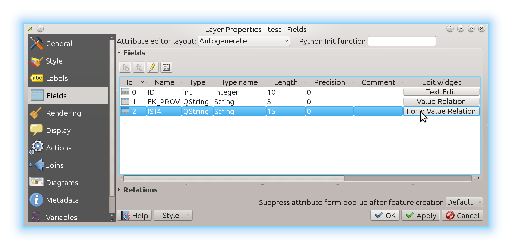
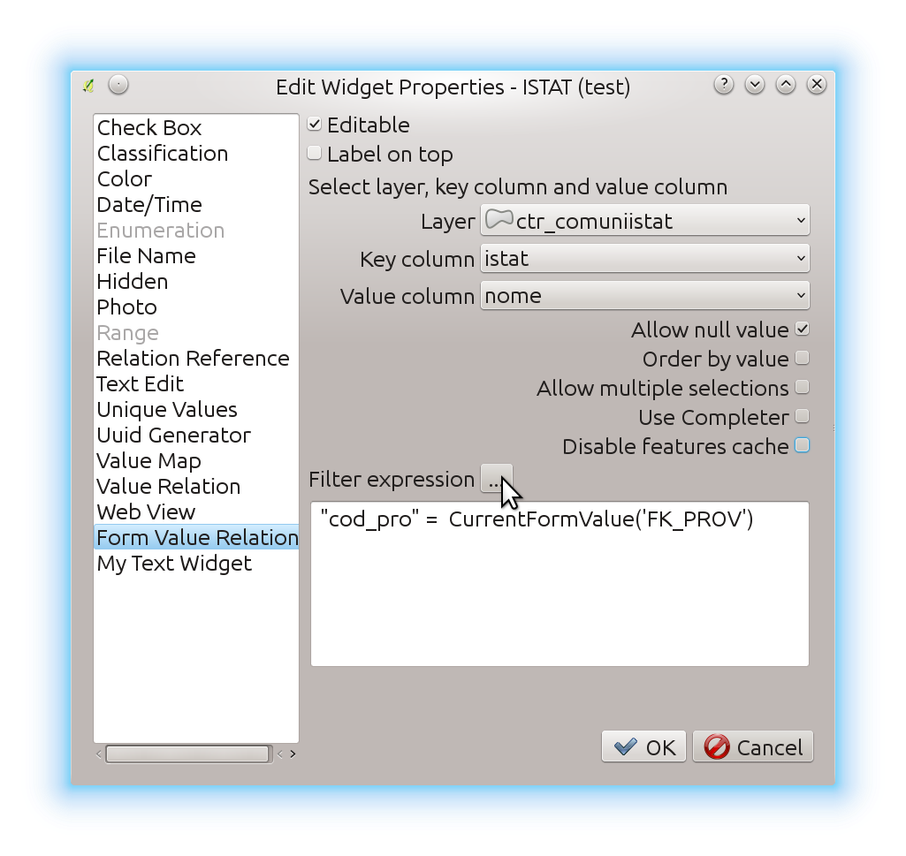
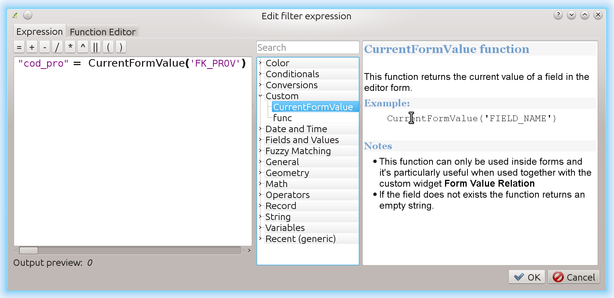
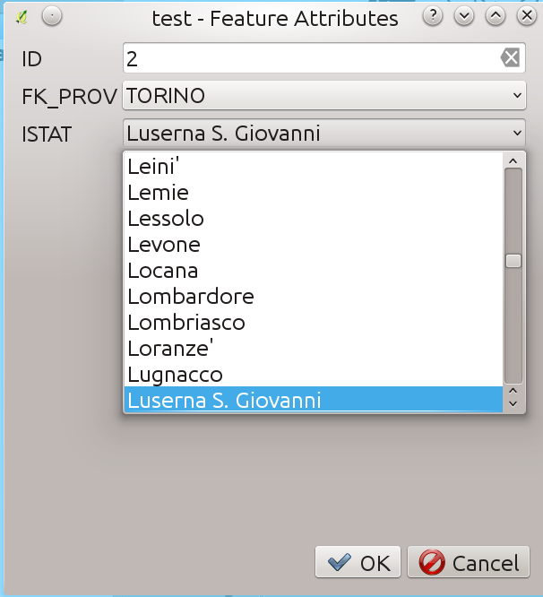

Form Aware Value RelationWidget
===============================

Description
-----------

This is a core-enhancement QGIS plugin that allow the implementation of complex
dynamic filters in QGIS attribute forms.

This widget can be used to implement drill-down forms, where the values available
in one field depend on the values of other fields.

This plugin has been partially funded (50%) by ARPA Piemonte.

Implementation
--------------

It is essentially a clone of the core "Value Relation" widget with some important
differences:

When the widget is created:

* the whole unfiltered features of the related layer are loaded and cached
* the form values of all the attributes are added to the context (see below)
* the filtering against the expression happens every time the  widget is refreshed
* a signal is bound to the form changes and if the changed field  is present in
  the filter expression, the features are filtered against the expression and
  the widget is refreshed

Using form values in the expression
-----------------------------------

A new expression function is available (in the "Custom" section)::

    CurrentFormValue('FIELD_NAME')

This function returns the current value of a field in the editor form.

Notes:
......

#. This function  can only be used inside forms and it's particularly useful when used together with the custom widget `Form Value Relation`
#. If the field does not exists the function returns an empty string.

Visual guide
------------------------------------

After plugin installation, you should see a new widget type available,
choose the Form Value Relation widget:

Configure the layers and fields and the expression:

Configure the expression using the CurrentFormValue function:

Enjoy the drill-down!

